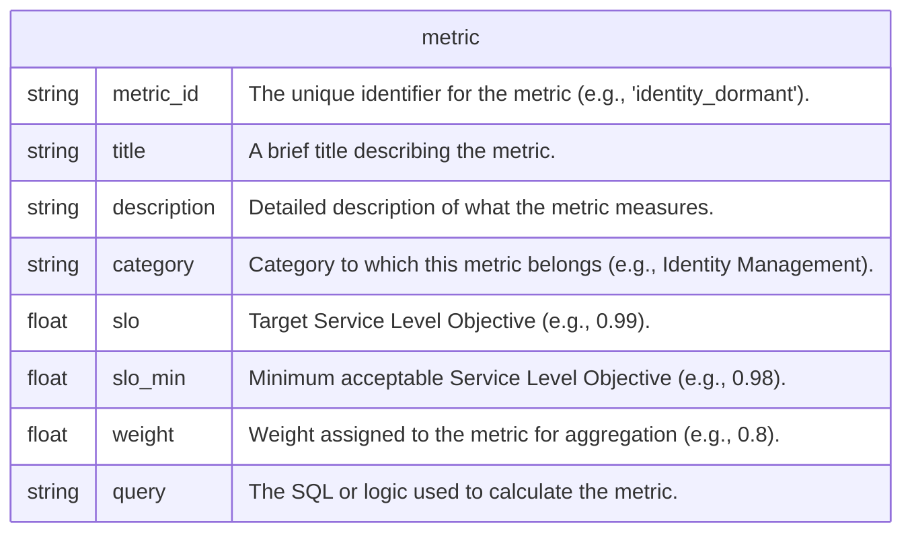
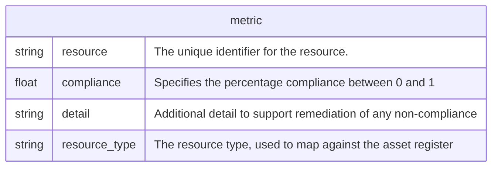

# Create a metric

## yaml definition



### Example file

```yaml
metric_id: identity_dormant
title: "Identity - Inactive Identities"
description: |
  Ensure that all user accounts are active and in use.
category: "Identity Management"
slo: 0.99       # Between 98% and 99% triggers a warning
slo_min: 0.98   # Below 98% is critical
weight: 0.8     # the weight this metric has when being aggregated
query: |
  select
    profile.login as resource,
    'user' as resource_type,
    last_login  as detail,
    case
      when datediff('day',cast(last_login as date),current_date()) < 90 then 1
      else 0
    end as compliance
  from
    {{ ref('okta_users') }}
  where
    status = 'ACTIVE'
```

## The query

The query is a jinja template.  I've been inpspired by [dbt](https://getdbt.com), but don't be fooled - it is not dbt.  The only function useful is `{{ ref }}` which is loosly doing the same thing.  When you need to write a query, you can use the `ref` statement to reference a downloaded `json` file.

When writing a query, the following must be adhered to.

* The query MUST return `resource`,`compliance`,`detail`,`resource_type`.

### Query definition

