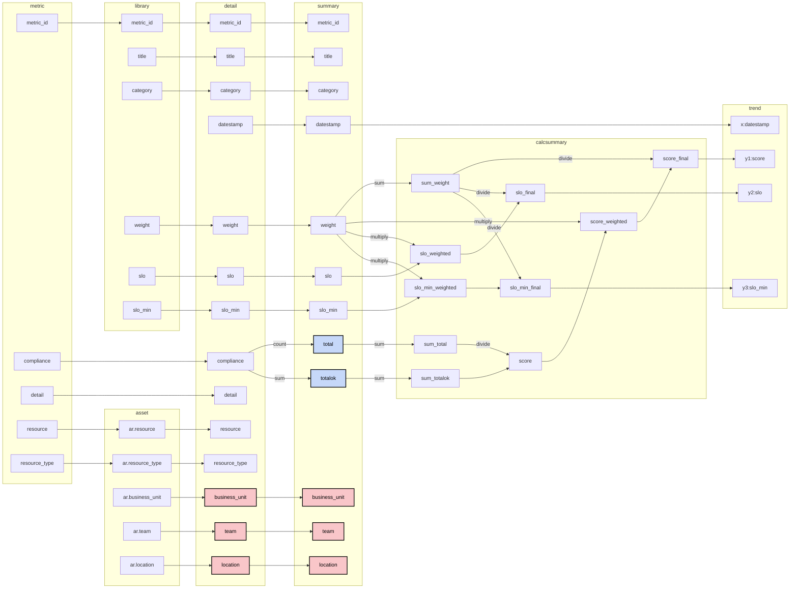

# Data flow

```mermaid
graph LR
    subgraph metric
        metric.metric_id[metric_id]
        metric.compliance[compliance]
        metric.detail[detail]
        metric.resource[resource]
        metric.resource_type[resource_type]
    end

    subgraph library
        library.metric_id[metric_id]
        library.title[title]
        library.category[category]
        library.weight[weight]
        library.slo[slo]
        library.slo_min[slo_min]
    end

    subgraph asset
        ar.resource
        ar.resource_type
        ar.business_unit
        ar.team
        ar.location
    end

    metric.resource --> ar.resource
    metric.resource_type --> ar.resource_type

    ar.business_unit --> detail.business_unit
    ar.team --> detail.team
    ar.location --> detail.location

    subgraph detail
        detail.datestamp[datestamp]
        detail.metric_id[metric_id]
        detail.title[title]
        detail.category[category]
        detail.weight[weight]
        detail.slo[slo]
        detail.slo_min[slo_min]
        detail.business_unit[business_unit]:::dim
        detail.team[team]:::dim
        detail.location[location]:::dim
        detail.detail[detail]
        detail.compliance[compliance]
        detail.resource[resource]
        detail.resource_type[resource_type]
    end

    subgraph summary
        summary.datestamp[datestamp]
        summary.metric_id[metric_id]
        summary.title[title]
        summary.category[category]
        summary.weight[weight]
        summary.slo[slo]
        summary.slo_min[slo_min]
        summary.business_unit[business_unit]:::dim
        summary.team[team]:::dim
        summary.location[location]:::dim
        summary.totalok[totalok]:::calc
        summary.total[total]:::calc
    end

    subgraph calcsummary
        calc.sum_total[sum_total]
        calc.sum_totalok[sum_totalok]
        calc.score[score]
        calc.score_weighted[score_weighted]
        calc.sum_weight[sum_weight]
        calc.score_final[score_final]

        calc.slo_final[slo_final]
        calc.slo_min_final[slo_min_final]

        calc.slo_weighted[slo_weighted]
        calc.slo_min_weighted[slo_min_weighted]
    end

    summary.slo --> calc.slo_weighted
    summary.slo_min --> calc.slo_min_weighted
    summary.total -- sum --> calc.sum_total
    summary.totalok -- sum --> calc.sum_totalok
    calc.sum_totalok --> calc.score
    calc.sum_total -- divide --> calc.score
    calc.score --> calc.score_weighted
    summary.weight -- sum --> calc.sum_weight
    summary.weight -- multiply --> calc.score_weighted
    summary.weight -- multiply --> calc.slo_weighted
    summary.weight -- multiply --> calc.slo_min_weighted
    calc.score_weighted --> calc.score_final
    calc.sum_weight -- divide --> calc.score_final
    calc.sum_weight -- divide --> calc.slo_final
    calc.sum_weight -- divide --> calc.slo_min_final
    calc.slo_weighted --> calc.slo_final
    calc.slo_min_weighted --> calc.slo_min_final

    calc.score_final --> trend.score
    calc.slo_final --> trend.slo
    calc.slo_min_final --> trend.slo_min

    subgraph trend
        trend.datestamp[x:datestamp]
        trend.slo[y2:slo]
        trend.slo_min[y3:slo_min]
        trend.score[y1:score]
    end

    library.metric_id --> detail.metric_id
    library.title --> detail.title
    library.category --> detail.category
    library.slo --> detail.slo
    library.slo_min --> detail.slo_min
    library.weight --> detail.weight

    metric.metric_id ---> library.metric_id
    ar.resource --> detail.resource
    ar.resource_type --> detail.resource_type
    metric.compliance --> detail.compliance
    metric.detail --> detail.detail
    detail.datestamp --> summary.datestamp
    detail.metric_id --> summary.metric_id
    detail.title --> summary.title
    detail.category --> summary.category
    detail.weight --> summary.weight
    detail.slo --> summary.slo
    detail.slo_min --> summary.slo_min
    detail.business_unit --> summary.business_unit
    detail.team --> summary.team
    detail.location --> summary.location
    detail.compliance -- count --> summary.total
    detail.compliance -- sum --> summary.totalok

    summary.datestamp --> trend.datestamp
    
    classDef dim fill:#f9c6c9,stroke:#000,stroke-width:2px,color:#000;
    classDef calc fill:#c6d8f9,stroke:#000,stroke-width:2px,color:#000;

```