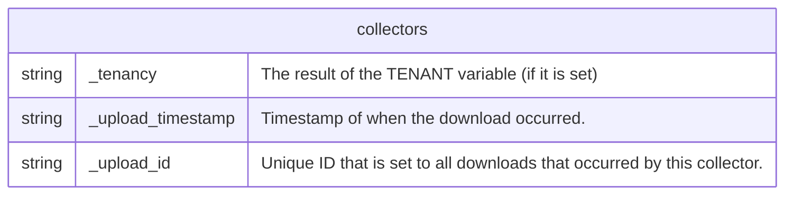

# Data Model

## Collectors

The collectors will save the result from the APIs in their native `json` format.  A number of additional field are appended to the data source.

```mermaid
erDiagram
    collectors {
        string _tenancy             "The result of the TENANT variable (if it is set)"
        string _upload_timestamp    "Timestamp of when the download occurred."
        string _upload_id           "Unique ID that is set to all downloads that occurred by this collector."
    }
```