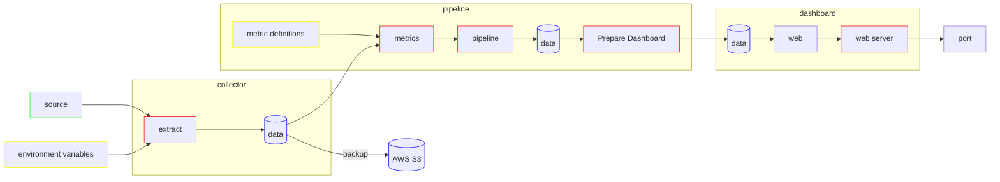

# automated-security-reporting
Open Source Security Report Platform

## High Level Architecture

## Architecture

* [Data Model](00-docs/data-model.md)
* [Data Flow](00-docs/data-flow.md)

## Collectors

* [How to](00-docs/how-to-run-an-extraction.md) run an extraction
* [Writing](00-docs/writing-a-collector.md) your own collector
* [List](00-docs/collectors.md) of collectors that can be used

## Metrics

* [How to](00-docs/how-to-run-metrics.md) run metrics
* [Creating](00-docs/create-a-metric.md) a metric
* [List](00-docs/metrics.md) of metrics

## Dashboard

TODO