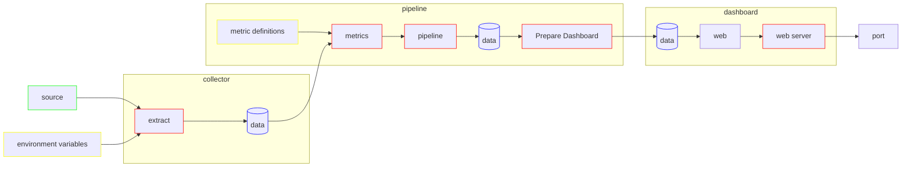

# automated-security-reporting
Open Source Security Report Platform

## High Level Architecture

```mermaid
graph LR
    source:::source
    environment[environment variables]:::config
    subgraph collector
        
        collector.extract[extract]:::code
        collector.data[(data)]:::data

        collector.extract --> collector.data
    end
    source --> collector.extract
    environment --> collector.extract

    subgraph pipeline
        metrics.definition[metric definitions]:::config
        metrics.process[metrics]:::code
        metrics.pipeline[pipeline]:::code

        metrics.data[(data)]:::data

        metrics.process --> metrics.pipeline
        metrics.pipeline --> metrics.data

        metrics.prepdashboard[Prepare Dashboard]:::code
    end
    metrics.definition --> metrics.process
    collector.data --> metrics.process
    metrics.data --> metrics.prepdashboard
    
    port
    subgraph dashboard
        dashboard.data[(data)]:::data
        dashboard.web[web]
        dashboard.server[web server]:::code
    end
    dashboard.web --> dashboard.server
    dashboard.server --> port
    metrics.prepdashboard --> dashboard.data
    dashboard.data --> dashboard.web

    classDef source stroke:#0f0
    classDef data stroke:#00f
    classDef code stroke:#f00
    classDef config stroke:#ff0

    classDef dim fill:#f9c6c9,stroke:#000,stroke-width:2px,color:#000;
    classDef calc fill:#c6d8f9,stroke:#000,stroke-width:2px,color:#000;
```
