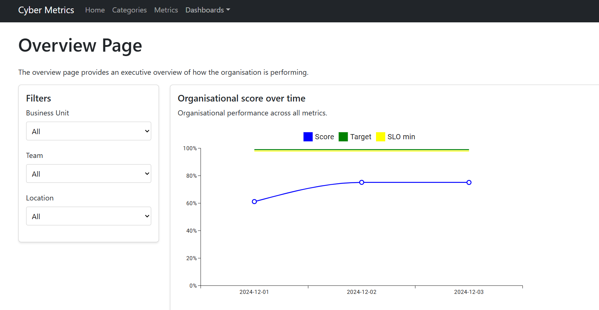
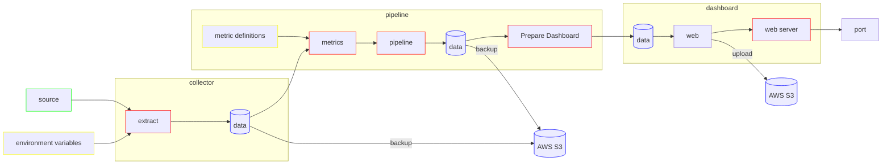
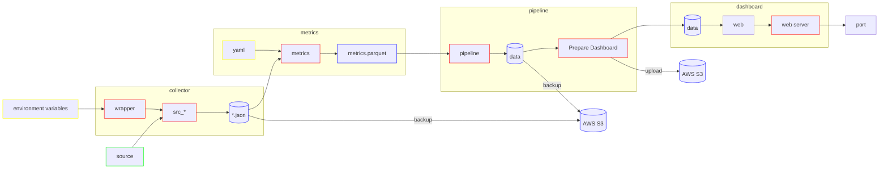

# automated-security-reporting

[](https://github.com/massyn/automated-security-reporting/actions/workflows/build.yml) 

Automated Security Reporting is a continuous assurance or executive cyber security reporting solution.  A number of [collectors](00-docs/collectors.md) and [metrics](00-docs/metrics.md) are currently supported, with more coming.

> Got an idea for a new collector or a metric?  Submit yours now as an [issue](https://github.com/massyn/automated-security-reporting/issues/new).



## High Level Architecture



### Information flow



## Quick start using Docker

Grab your Crowdstrike API keys. (or if not Crowdstrike, any of the built-in [collectors](00-docs/collectors.md)).

Run

```bash
docker run -p 80:80 \
    -e FALCON_CLIENT_ID="xxx" \
    -e FALCON_SECRET="xxx" \
    -t massyn/asr:main 
```

Open your browser to http://localhost, and view your dashboard.

### Modes of operation

By default, the Docker instance will start up, do an extraction, and update the local website on the running instance.

The instance can also run in an extract-only mode, where the data will be downloaded and processed, and optionally also updated to a target S3 hosted website.

A typical use case would entail the following :

```bash
docker run -p 80:80 \
    -e FALCON_CLIENT_ID="xxx" \
    -e FALCON_SECRET="xxx" \
    -e STORE_AWS_S3_BUCKET=my-s3-bucket-name \
    -e STORE_AWS_S3_WEB=my-s3-bucket-name-web \
    -e EXTRACT_ONLY=true \
    -td massyn/asr:main 
```

where

* `STORE_AWS_S3_BUCKET` is the AWS S3 bucket where the target data files will be stored to retain state.
* `STORE_AWS_S3_WEB` is the AWS S3 bucket where the static website is served from.
* `EXTRACT_ONLY` will only do the extract, update the target S3 website, and then terminate.

## Architecture

* [Data Model](00-docs/data-model.md)
* [Data Flow](00-docs/data-flow.md)

## Collectors

* [How to](00-docs/how-to-run-an-extraction.md) run an extraction
* [Writing](00-docs/writing-a-collector.md) your own collector
* [List](00-docs/collectors.md) of collectors that can be used

## Metrics

* [How to](00-docs/how-to-run-metrics.md) run metrics
* [Creating](00-docs/create-a-metric.md) a metric
* [List](00-docs/metrics.md) of metrics

## Dashboard

* Setting up the [Dashboard](00-docs/dashboard.md)